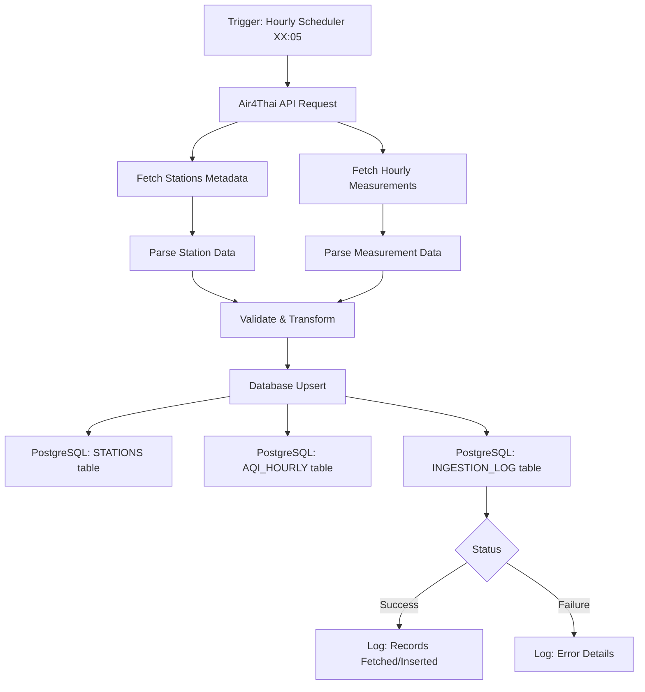
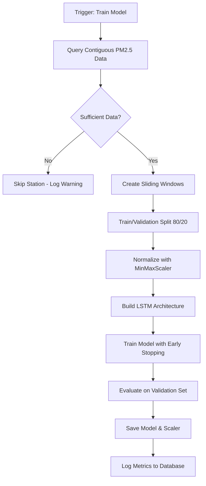
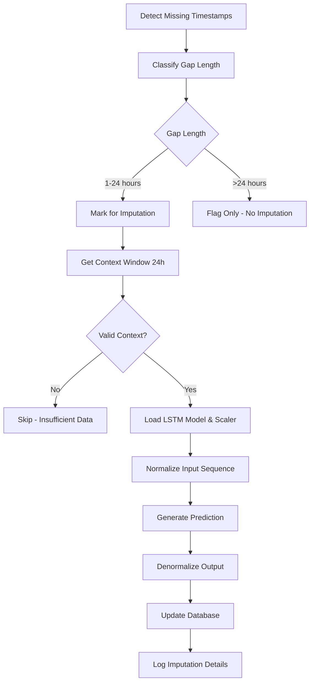
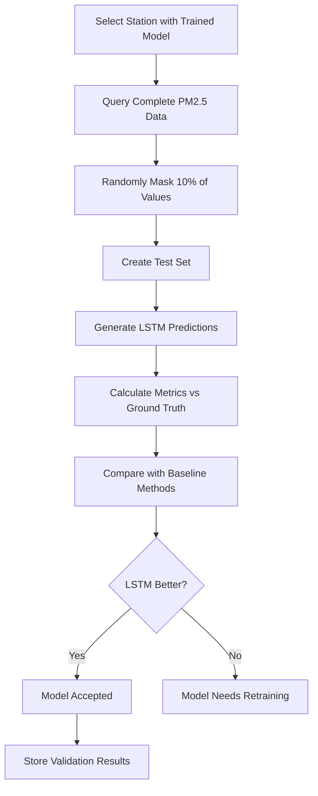
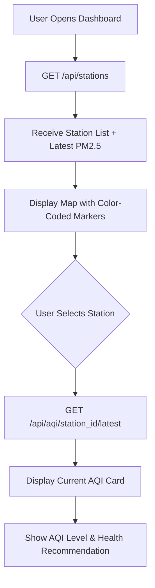
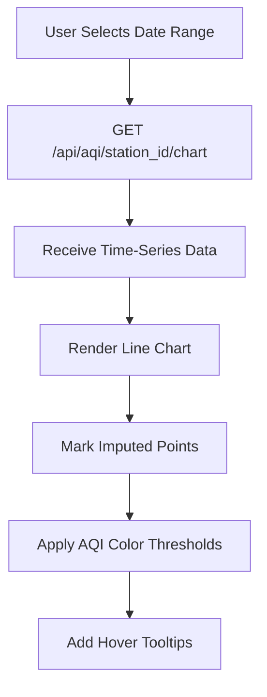
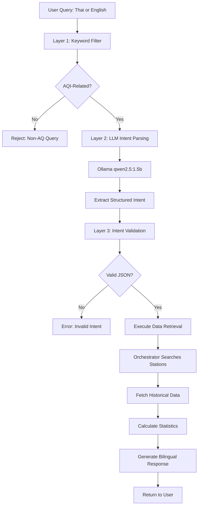

# Environmental AQI Bot - Application Workflow

## Table of Contents
- [System Overview](#system-overview)
- [Architecture Diagram](#architecture-diagram)
- [Workflow 1: Data Ingestion Pipeline](#workflow-1-data-ingestion-pipeline)
- [Workflow 2: LSTM Model Training](#workflow-2-lstm-model-training)
- [Workflow 3: Gap Detection & Filling](#workflow-3-gap-detection--filling)
- [Workflow 4: Model Validation](#workflow-4-model-validation)
- [Workflow 5: User Interactions - Dashboard](#workflow-5-user-interactions---dashboard)
- [Workflow 6: AI Chatbot Query Processing](#workflow-6-ai-chatbot-query-processing)
- [Workflow 7: Scheduled Automation](#workflow-7-scheduled-automation)
- [Workflow 8: Initial System Setup](#workflow-8-initial-system-setup)
- [Workflow 9: Daily Operations](#workflow-9-daily-operations)
- [Data Flow Diagram](#data-flow-diagram)
- [Key Endpoints Reference](#key-endpoints-reference)
- [Technical Specifications](#technical-specifications)

---

## System Overview

**Environmental AQI Bot** is a production-grade Air Quality Index (AQI) monitoring system that:
- Collects hourly PM2.5 and other pollutant data from Thailand's Air4Thai APIs
- Stores data in PostgreSQL with PostGIS spatial support
- Uses LSTM deep learning models to predict and fill missing values
- Provides a web dashboard and AI chatbot for natural language queries
- Automatically ingests and processes data on a scheduled basis

**Key Features:**
- 12 environmental parameters (6 pollutants + 6 weather metrics)
- LSTM-based gap filling for 1-24 hour missing data
- Bilingual support (Thai/English)
- Geographic search with PostGIS
- Automated hourly data ingestion
- Complete audit trails for data quality

---

## Architecture Diagram

```
┌─────────────────────────────────────────────────────────┐
│                   DOCKER COMPOSE STACK                   │
├─────────────────────────────────────────────────────────┤
│                                                           │
│  PostgreSQL (PostGIS)                                    │
│  ├─ Port: 5433 (internal only)                          │
│  ├─ Database: envi_aqi_db                               │
│  ├─ Extensions: PostGIS 3.4, TimescaleDB ready          │
│  └─ Volumes: postgres_data (persistent)                 │
│                                                           │
│  FastAPI Backend (api service)                          │
│  ├─ Port: 8000 → 5800 (via Nginx)                      │
│  ├─ Depends: postgres (healthy)                         │
│  ├─ Memory: 512M-2G                                     │
│  ├─ 60+ REST endpoints                                  │
│  └─ Health: /health (DB connectivity check)             │
│                                                           │
│  Frontend (React + Vite)                                │
│  ├─ Port: 5800 (public facing)                          │
│  ├─ Depends: api (healthy)                              │
│  ├─ Memory: 32M-128M                                    │
│  ├─ Base path: /ebot/                                   │
│  └─ Static: Nginx server                                │
│                                                           │
│  Scheduler Service                                      │
│  ├─ Command: python -m backend_api.scheduler            │
│  ├─ Depends: postgres (healthy)                         │
│  ├─ Memory: 256M-1G                                     │
│  ├─ Engine: APScheduler                                 │
│  └─ Jobs: Hourly ingestion, weekly training             │
│                                                           │
│  Ollama (Local LLM)                                     │
│  ├─ Model: qwen2.5:1.5b (auto-download)                │
│  ├─ Port: 11434 (internal only)                         │
│  ├─ Memory: 1G-4G                                       │
│  └─ Purpose: AI chatbot intent parsing                  │
│                                                           │
└─────────────────────────────────────────────────────────┘
```

---

## Workflow 1: Data Ingestion Pipeline

### Trigger Points
- **Automated**: Scheduler runs every hour at XX:05
- **Manual**: `POST /api/ingest/batch` (30-day history)
- **Manual**: `POST /api/ingest/hourly` (latest hour)

### Process Flow



### Step 1: API Connection
**File**: `backend_api/services/ingestion.py:864`

```python
# Connection Configuration
- HTTP Client: Async with connection pooling
- Max Connections: 20
- Keepalive Connections: 10
- Timeout: 30 seconds
- Retry: 3 attempts with exponential backoff
- Circuit Breaker: Opens after 5 failures, resets after 60s
- Rate Limit Handling: 30s delay on 429 responses
```

### Step 2: Data Collection
**Air4Thai API Endpoints:**
- `GET /api/v2/stations` - Station metadata (name, coordinates, type)
- `GET /api/v2/hourly` - Hourly measurements for all stations

**Parameters Collected (12 total):**
1. **Pollutants**: PM2.5, PM10, O3, CO, NO2, SO2
2. **Weather**: Wind Speed (WS), Wind Direction (WD), Temperature (TEMP), Relative Humidity (RH), Barometric Pressure (BP), Rainfall (RAIN)

### Step 3: Data Validation & Transformation
```python
Validation Rules:
├─ PM2.5: 0-500 µg/m³
├─ PM10: 0-600 µg/m³
├─ Temperature: -50 to 60°C
├─ Humidity: 0-100%
├─ Wind Speed: 0-50 m/s
└─ Null values: Preserved for later imputation
```

### Step 4: Database Storage
**Tables Updated:**

**STATIONS**
```sql
CREATE TABLE stations (
    station_id VARCHAR PRIMARY KEY,
    name_th VARCHAR,
    name_en VARCHAR,
    lat FLOAT,
    lon FLOAT,
    location GEOGRAPHY(Point, 4326),  -- PostGIS
    station_type VARCHAR,
    updated_at TIMESTAMP
);
```

**AQI_HOURLY**
```sql
CREATE TABLE aqi_hourly (
    station_id VARCHAR,
    datetime TIMESTAMP,
    pm25 FLOAT, pm10 FLOAT, o3 FLOAT, co FLOAT, no2 FLOAT, so2 FLOAT,
    ws FLOAT, wd FLOAT, temp FLOAT, rh FLOAT, bp FLOAT, rain FLOAT,
    is_imputed BOOLEAN DEFAULT FALSE,
    pm25_imputed BOOLEAN DEFAULT FALSE,
    model_version VARCHAR,
    PRIMARY KEY (station_id, datetime)
);
```

**INGESTION_LOG**
```sql
CREATE TABLE ingestion_log (
    id SERIAL PRIMARY KEY,
    run_type VARCHAR,  -- 'batch' or 'hourly'
    status VARCHAR,    -- 'running', 'completed', 'failed'
    records_fetched INTEGER,
    records_inserted INTEGER,
    start_time TIMESTAMP,
    end_time TIMESTAMP,
    error_message TEXT
);
```

### Step 5: Audit Trail
Every ingestion run logs:
- Start/end timestamps
- Records fetched from API
- Records inserted to database
- Success/failure status
- Error messages (if any)

---

## Workflow 2: LSTM Model Training

### Trigger Points
- **Automated**: Weekly scheduler (Sunday 03:00)
- **Manual**: `POST /api/model/train-all`
- **Manual**: `POST /api/model/train/{station_id}`

### Training Prerequisites
- Minimum 168 hours (7 days) of contiguous PM2.5 data
- At least 70% data completeness for training period

### Process Flow



### Step 1: Data Preparation
**File**: `backend_model/services/lstm_model.py:551`

```python
# Query Strategy
SELECT station_id, datetime, pm25
FROM aqi_hourly
WHERE pm25 IS NOT NULL
  AND is_imputed = FALSE
ORDER BY station_id, datetime;

# Group into contiguous sequences
# Sequence breaks at gaps > 1 hour
# Minimum sequence length: 168 hours (7 days)
```

### Step 2: Sliding Window Creation
```python
Input Window: 24 hours (timesteps)
Output: Next 1 hour prediction

Example:
Input:  [hour_0, hour_1, ..., hour_23]
Output: hour_24

Total samples = (sequence_length - window_size)
```

### Step 3: Data Normalization
```python
from sklearn.preprocessing import MinMaxScaler

scaler = MinMaxScaler(feature_range=(0, 1))
normalized_data = scaler.fit_transform(pm25_values)

# Save scaler for inverse transform during prediction
pickle.dump(scaler, f'models/scaler_{station_id}.pkl')
```

### Step 4: LSTM Architecture
**File**: `backend_model/services/lstm_model.py`

```python
from tensorflow.keras.models import Sequential
from tensorflow.keras.layers import LSTM, Dense, Dropout

model = Sequential([
    # Layer 1: LSTM with 64 units
    LSTM(64, return_sequences=True, input_shape=(24, 1)),
    Dropout(0.2),

    # Layer 2: LSTM with 32 units
    LSTM(32, return_sequences=False),
    Dropout(0.2),

    # Output layer: Dense with 1 neuron
    Dense(1)
])

# Compilation
model.compile(
    optimizer=Adam(learning_rate=0.001),
    loss='mean_squared_error',
    metrics=['mean_absolute_error']
)
```

### Step 5: Training Configuration
```python
Training Parameters:
├─ Batch Size: 32
├─ Epochs: 100 (with early stopping)
├─ Validation Split: 20%
├─ Early Stopping:
│  ├─ Monitor: validation loss
│  ├─ Patience: 10 epochs
│  └─ Restore best weights: True
└─ Callbacks: ModelCheckpoint, EarlyStopping
```

### Step 6: Model Persistence
```python
# Save trained model
model.save(f'models/lstm_{station_id}.keras')

# Model caching in memory
model_cache = {
    station_id: {
        'model': model,
        'scaler': scaler,
        'timestamp': datetime.now(),
        'ttl': 3600  # 1 hour
    }
}
```

### Step 7: Training Metrics Logging
**Table**: `MODEL_TRAINING_LOG`

```sql
CREATE TABLE model_training_log (
    id SERIAL PRIMARY KEY,
    station_id VARCHAR,
    model_version VARCHAR,
    training_samples INTEGER,
    validation_samples INTEGER,
    rmse FLOAT,
    mae FLOAT,
    r2_score FLOAT,
    training_duration_seconds INTEGER,
    created_at TIMESTAMP
);
```

**Metrics Stored:**
- RMSE (Root Mean Squared Error)
- MAE (Mean Absolute Error)
- R² (Coefficient of Determination)
- Training duration
- Sample counts

---

## Workflow 3: Gap Detection & Filling

### Trigger Points
- **Automated**: After hourly ingestion (if models trained)
- **Manual**: `POST /api/impute/all`
- **Manual**: `POST /api/impute/{station_id}`

### Gap Classification
```python
Gap Types:
├─ Short (1-3 hours):   IMPUTE with LSTM
├─ Medium (4-24 hours): IMPUTE with LSTM
└─ Long (>24 hours):    FLAG ONLY (not imputable)
```

### Process Flow



### Step 1: Missing Data Detection
**File**: `backend_api/services/ingestion.py`

```python
def detect_missing_data(station_id: str,
                        start_date: datetime,
                        end_date: datetime):
    """
    Detect missing hourly records
    """
    # Expected records
    expected_hours = (end_date - start_date).total_seconds() / 3600

    # Actual records
    actual_count = db.query(AQIHourly).filter(
        AQIHourly.station_id == station_id,
        AQIHourly.datetime.between(start_date, end_date)
    ).count()

    # Calculate gaps
    missing_percentage = (expected_hours - actual_count) / expected_hours * 100

    return {
        'expected': expected_hours,
        'actual': actual_count,
        'missing': expected_hours - actual_count,
        'percentage': missing_percentage
    }
```

### Step 2: Context Window Validation
**File**: `backend_model/services/imputation.py`

```python
def get_context_window(station_id: str,
                       target_datetime: datetime,
                       window_size: int = 24):
    """
    Fetch previous 24 hours of valid PM2.5 data
    """
    end_time = target_datetime - timedelta(hours=1)
    start_time = end_time - timedelta(hours=window_size)

    context_data = db.query(AQIHourly).filter(
        AQIHourly.station_id == station_id,
        AQIHourly.datetime.between(start_time, end_time),
        AQIHourly.pm25.isnot(None)
    ).order_by(AQIHourly.datetime).all()

    # Validation
    if len(context_data) < window_size:
        return None  # Insufficient context

    # Check for contiguity (no gaps > 24h)
    for i in range(1, len(context_data)):
        gap = context_data[i].datetime - context_data[i-1].datetime
        if gap.total_seconds() / 3600 > 24:
            return None  # Non-contiguous

    return [record.pm25 for record in context_data]
```

### Step 3: LSTM Prediction
```python
def impute_missing_value(station_id: str,
                         target_datetime: datetime,
                         context_window: list):
    """
    Generate imputed value using LSTM
    """
    # Load cached or new model
    model, scaler = load_model(station_id)

    # Prepare input
    context_array = np.array(context_window).reshape(-1, 1)
    normalized_input = scaler.transform(context_array)

    # Reshape for LSTM: (samples, timesteps, features)
    X = normalized_input.reshape(1, 24, 1)

    # Predict
    normalized_prediction = model.predict(X, verbose=0)

    # Denormalize
    imputed_value = scaler.inverse_transform(normalized_prediction)[0][0]

    # Validate range
    imputed_value = max(0, min(imputed_value, 500))  # PM2.5 range

    return imputed_value
```

### Step 4: Database Update
```python
# Update AQI_HOURLY record
db.query(AQIHourly).filter(
    AQIHourly.station_id == station_id,
    AQIHourly.datetime == target_datetime
).update({
    'pm25': imputed_value,
    'is_imputed': True,
    'pm25_imputed': True,
    'model_version': f'v{model_version}'
})
```

### Step 5: Imputation Audit Trail
**Table**: `IMPUTATION_LOG`

```sql
CREATE TABLE imputation_log (
    id SERIAL PRIMARY KEY,
    station_id VARCHAR,
    datetime TIMESTAMP,
    parameter VARCHAR,  -- e.g., 'pm25'
    imputed_value FLOAT,
    confidence_score FLOAT,
    imputation_method VARCHAR,  -- 'lstm', 'linear', 'mean'
    input_window_start TIMESTAMP,
    input_window_end TIMESTAMP,
    context_window_size INTEGER,
    model_version VARCHAR,
    rmse_score FLOAT,
    created_at TIMESTAMP
);
```

---

## Workflow 4: Model Validation

### Trigger Points
- **Manual**: `POST /api/validate/{station_id}`
- **Manual**: `POST /api/validate/all`

### Validation Strategy
**Offline Validation**: Mask 10% of existing (known) PM2.5 values and predict them using LSTM

### Process Flow



### Step 1: Data Preparation
**File**: `backend_model/services/validation.py`

```python
def prepare_validation_data(station_id: str):
    """
    Prepare masked data for validation
    """
    # Get all non-imputed PM2.5 values
    all_data = db.query(AQIHourly).filter(
        AQIHourly.station_id == station_id,
        AQIHourly.pm25.isnot(None),
        AQIHourly.is_imputed == False
    ).order_by(AQIHourly.datetime).all()

    # Randomly select 10% for testing
    test_size = int(len(all_data) * 0.1)
    test_indices = random.sample(range(len(all_data)), test_size)

    test_data = []
    for idx in sorted(test_indices):
        test_data.append({
            'datetime': all_data[idx].datetime,
            'actual_value': all_data[idx].pm25,
            'context_window': get_context_window(
                station_id,
                all_data[idx].datetime
            )
        })

    return test_data
```

### Step 2: LSTM Predictions
```python
lstm_predictions = []
for test_point in test_data:
    if test_point['context_window'] is not None:
        predicted = impute_missing_value(
            station_id,
            test_point['datetime'],
            test_point['context_window']
        )
        lstm_predictions.append({
            'datetime': test_point['datetime'],
            'actual': test_point['actual_value'],
            'predicted': predicted
        })
```

### Step 3: Baseline Comparisons
**Method 1: Linear Interpolation**
```python
def linear_interpolation_baseline(test_data):
    """
    Simple linear interpolation between nearest values
    """
    predictions = []
    for point in test_data:
        # Get nearest before and after
        before = get_nearest_before(station_id, point['datetime'])
        after = get_nearest_after(station_id, point['datetime'])

        # Linear interpolation
        predicted = (before.pm25 + after.pm25) / 2
        predictions.append(predicted)

    return predictions
```

**Method 2: Forward Fill**
```python
def forward_fill_baseline(test_data):
    """
    Use last known value
    """
    predictions = []
    for point in test_data:
        last_value = db.query(AQIHourly).filter(
            AQIHourly.station_id == station_id,
            AQIHourly.datetime < point['datetime'],
            AQIHourly.pm25.isnot(None)
        ).order_by(AQIHourly.datetime.desc()).first()

        predictions.append(last_value.pm25)

    return predictions
```

### Step 4: Metric Calculation
```python
from sklearn.metrics import mean_squared_error, mean_absolute_error, r2_score
import numpy as np

def calculate_metrics(actual, predicted):
    """
    Calculate performance metrics
    """
    rmse = np.sqrt(mean_squared_error(actual, predicted))
    mae = mean_absolute_error(actual, predicted)
    r2 = r2_score(actual, predicted)

    return {
        'rmse': rmse,
        'mae': mae,
        'r2': r2
    }

# Calculate for all methods
lstm_metrics = calculate_metrics(actual_values, lstm_predictions)
linear_metrics = calculate_metrics(actual_values, linear_predictions)
forward_metrics = calculate_metrics(actual_values, forward_predictions)
```

### Step 5: Validation Results
```python
validation_results = {
    'station_id': station_id,
    'test_samples': len(test_data),
    'lstm': lstm_metrics,
    'linear_interpolation': linear_metrics,
    'forward_fill': forward_metrics,
    'improvement_vs_linear': {
        'rmse': (linear_metrics['rmse'] - lstm_metrics['rmse']) / linear_metrics['rmse'] * 100,
        'mae': (linear_metrics['mae'] - lstm_metrics['mae']) / linear_metrics['mae'] * 100
    },
    'acceptance': lstm_metrics['rmse'] < linear_metrics['rmse']
}
```

### Acceptance Criteria
```python
Model is ACCEPTED if:
├─ LSTM RMSE < Linear Interpolation RMSE
├─ LSTM MAE < Mean of test set standard deviation
└─ R² > 0.5 (explains >50% of variance)
```

---

## Workflow 5: User Interactions - Dashboard

### Dashboard Pages
1. **Dashboard** - Main monitoring view
2. **Models** - Training status & metrics
3. **Admin** - System health & data quality
4. **Chat** - AI chatbot (Ollama)
5. **Claude** - Alternative AI chatbot (Anthropic API)

### User Flow 1: View Station AQI



**API Endpoint**: `GET /api/stations`
**File**: `backend_api/main.py:1772`

```json
Response:
[
    {
        "station_id": "01t",
        "name_th": "ท่าพระจันทร์ กทม.",
        "name_en": "Tha Phra Chan, Bangkok",
        "lat": 13.7461,
        "lon": 100.4927,
        "latest_pm25": 45.2,
        "aqi_level": "Moderate",
        "aqi_level_th": "ปานกลาง",
        "color": "#ffff00",
        "updated_at": "2026-01-10T14:00:00"
    }
]
```

### User Flow 2: View Historical Chart



**API Endpoint**: `GET /api/aqi/{station_id}/chart?start_date=2026-01-03&end_date=2026-01-10`

```json
Response:
{
    "station_id": "01t",
    "data": [
        {
            "datetime": "2026-01-03T00:00:00",
            "pm25": 42.5,
            "is_imputed": false
        },
        {
            "datetime": "2026-01-03T01:00:00",
            "pm25": 38.2,
            "is_imputed": true,
            "model_version": "v123"
        }
    ],
    "statistics": {
        "min": 12.3,
        "max": 78.9,
        "mean": 42.7,
        "median": 41.2,
        "imputed_count": 15,
        "total_count": 168,
        "imputed_percentage": 8.93
    }
}
```

**Frontend Rendering**: `frontend/src/components/organisms/AQIChart.jsx`

```jsx
Chart Features:
├─ X-axis: Time (hourly intervals)
├─ Y-axis: PM2.5 concentration (µg/m³)
├─ Line color: Changes based on AQI thresholds
├─ Imputed points: Marked with dotted line or circle icon
├─ Tooltips: Show value, time, imputation status
└─ Background bands: Color-coded AQI levels
```

### User Flow 3: Multi-Parameter View

**Component**: `frontend/src/components/organisms/MultiParameterChart.jsx`

**API Endpoint**: `GET /api/aqi/full/{station_id}?parameters=pm25,pm10,temp,rh,o3,co`

```json
Response:
{
    "station_id": "01t",
    "parameters": ["pm25", "pm10", "temp", "rh", "o3", "co"],
    "data": [
        {
            "datetime": "2026-01-10T14:00:00",
            "pm25": 45.2,
            "pm10": 68.1,
            "temp": 28.5,
            "rh": 65.2,
            "o3": 32.1,
            "co": 0.8
        }
    ],
    "statistics": {
        "pm25": {"min": 12.3, "max": 78.9, "mean": 42.7},
        "temp": {"min": 22.1, "max": 35.6, "mean": 28.9}
    }
}
```

### User Flow 4: Model Status View

**Page**: `frontend/src/pages/Models.jsx`

**API Endpoint**: `GET /api/model/all-status`

```json
Response:
[
    {
        "station_id": "01t",
        "station_name": "Tha Phra Chan",
        "model_exists": true,
        "model_version": "v123",
        "last_trained": "2026-01-07T03:00:00",
        "training_samples": 2856,
        "metrics": {
            "rmse": 3.24,
            "mae": 2.18,
            "r2": 0.87
        },
        "validation_status": "passed",
        "imputation_ready": true,
        "gap_fill_count": 142
    }
]
```

**Display Features:**
- Training status (trained/not trained)
- Model performance metrics (RMSE, MAE, R²)
- Last training date
- Gap fill readiness
- Action buttons (Train, Validate, View Logs)

---

## Workflow 6: AI Chatbot Query Processing

### Architecture: Three-Layer Security



### Layer 1: Keyword Filter (Pre-LLM)
**File**: `backend_api/services/ai/`

```python
AQI_KEYWORDS = [
    # Thai
    'ฝุ่น', 'pm2.5', 'pm10', 'คุณภาพอากาศ', 'มลพิษ',
    # English
    'air quality', 'aqi', 'pollution', 'dust', 'pm2.5', 'pm10',
    'ozone', 'o3', 'carbon monoxide', 'co'
]

def is_aqi_related(query: str) -> bool:
    query_lower = query.lower()
    return any(keyword in query_lower for keyword in AQI_KEYWORDS)
```

### Layer 2: LLM Intent Parsing (Ollama)

**Supported Intent Types:**
1. `search_stations` - Find stations by location
2. `get_data` - Retrieve historical data

**Prompt Template:**
```python
INTENT_EXTRACTION_PROMPT = """
You are an air quality data assistant. Parse the user query into structured JSON.

User Query: "{query}"

Extract:
- intent: "search_stations" or "get_data"
- location: City or region name (Thai or English)
- pollutant: Parameter name (pm25, pm10, o3, etc.)
- timeframe: "last 7 days", "today", "this month", etc.
- language: "th" or "en" (detect from query)

Output ONLY valid JSON, no explanation.

Example:
{
    "intent": "get_data",
    "location": "Bangkok",
    "pollutant": "pm25",
    "timeframe": "last 7 days",
    "language": "en"
}
"""

# Ollama API Call
response = ollama_client.generate(
    model="qwen2.5:1.5b",
    prompt=INTENT_EXTRACTION_PROMPT.format(query=user_query),
    temperature=0.1,  # Deterministic
    max_tokens=200
)
```

### Layer 3: Intent Validation (Post-LLM)

```python
def validate_intent(intent_json: dict) -> bool:
    """
    Validate extracted intent structure
    """
    required_fields = ['intent', 'location', 'language']

    # Check required fields
    if not all(field in intent_json for field in required_fields):
        return False

    # Validate intent type
    if intent_json['intent'] not in ['search_stations', 'get_data']:
        return False

    # Sanitize location (prevent SQL injection)
    intent_json['location'] = sanitize_string(intent_json['location'])

    return True
```

### Data Retrieval: Orchestrator

**File**: `backend_api/services/ai/orchestrator.py`

```python
def process_query(intent: dict):
    """
    Execute intent and retrieve data
    """
    if intent['intent'] == 'search_stations':
        # Geographic search using PostGIS
        stations = db.query(Station).filter(
            func.ST_DWithin(
                Station.location,
                func.ST_MakePoint(lon, lat),
                radius_meters
            )
        ).all()

    elif intent['intent'] == 'get_data':
        # Parse timeframe
        start_date, end_date = parse_timeframe(intent['timeframe'])

        # Find stations in location
        stations = search_stations_by_location(intent['location'])

        # Fetch data for each station
        data = []
        for station in stations:
            records = db.query(AQIHourly).filter(
                AQIHourly.station_id == station.station_id,
                AQIHourly.datetime.between(start_date, end_date)
            ).all()

            # Calculate statistics
            pm25_values = [r.pm25 for r in records if r.pm25]
            stats = {
                'min': min(pm25_values),
                'max': max(pm25_values),
                'mean': sum(pm25_values) / len(pm25_values),
                'trend': calculate_trend(pm25_values),
                'aqi_level': classify_aqi(stats['mean'])
            }

            data.append({
                'station': station,
                'statistics': stats,
                'timeseries': records
            })

    return data
```

### Response Generation: Bilingual

```python
def generate_response(data: list, language: str):
    """
    Create natural language response
    """
    if language == 'th':
        template = """
        ค่า PM2.5 ใน{location} ในช่วง {timeframe}:

        - ค่าต่ำสุด: {min} µg/m³
        - ค่าสูงสุด: {max} µg/m³
        - ค่าเฉลี่ย: {mean} µg/m³
        - ระดับคุณภาพอากาศ: {aqi_level_th}

        คำแนะนำ: {health_recommendation_th}
        """
    else:
        template = """
        PM2.5 levels in {location} for {timeframe}:

        - Minimum: {min} µg/m³
        - Maximum: {max} µg/m³
        - Average: {mean} µg/m³
        - AQI Level: {aqi_level_en}

        Recommendation: {health_recommendation_en}
        """

    # Health recommendations by AQI level
    recommendations = get_health_recommendations(data[0]['statistics']['aqi_level'])

    return template.format(**data[0]['statistics'], **recommendations)
```

### Health Recommendations by AQI Level

```python
HEALTH_RECOMMENDATIONS = {
    'excellent': {
        'en': 'Air quality is excellent. Enjoy outdoor activities.',
        'th': 'คุณภาพอากาศดีเยี่ยม ออกกำลังกายกลางแจ้งได้ตามปกติ'
    },
    'good': {
        'en': 'Air quality is good. Normal activities are safe.',
        'th': 'คุณภาพอากาศดี ทำกิจกรรมกลางแจ้งได้ตามปกติ'
    },
    'moderate': {
        'en': 'Sensitive groups should consider limiting outdoor activities.',
        'th': 'กลุ่มเสี่ยงควรลดกิจกรรมกลางแจ้ง'
    },
    'unhealthy_sensitive': {
        'en': 'Sensitive groups should avoid outdoor activities. Wear a mask if going out.',
        'th': 'กลุ่มเสี่ยงควรหลีกเลี่ยงกิจกรรมกลางแจ้ง สวมหน้ากากหากจำเป็น'
    },
    'unhealthy': {
        'en': 'Everyone should avoid outdoor activities. Wear N95 mask if going out.',
        'th': 'ทุกคนควรหลีกเลี่ยงกิจกรรมกลางแจ้ง สวมหน้ากาก N95 หากจำเป็น'
    }
}
```

### Example Query Flow

**User Input**: "Show me PM2.5 in Bangkok for last 7 days"

**Step 1: Keyword Filter** ✓ (contains "PM2.5")

**Step 2: LLM Parsing**
```json
{
    "intent": "get_data",
    "location": "Bangkok",
    "pollutant": "pm25",
    "timeframe": "last 7 days",
    "language": "en"
}
```

**Step 3: Validation** ✓

**Step 4: Data Retrieval**
- Find all Bangkok stations (15 stations)
- Query last 7 days PM2.5 data
- Calculate statistics per station

**Step 5: Response**
```
PM2.5 levels in Bangkok for last 7 days:

Stations monitored: 15
- Minimum: 12.3 µg/m³ (Station: Tha Phra Chan)
- Maximum: 78.9 µg/m³ (Station: Din Daeng)
- City Average: 42.7 µg/m³
- AQI Level: Moderate

Recommendation: Sensitive groups (elderly, children, those with respiratory conditions) should consider limiting prolonged outdoor activities. General population can continue normal activities.

Trend: Decreasing over the past 3 days.
```

---

## Workflow 7: Scheduled Automation

### APScheduler Configuration
**File**: `backend_api/services/scheduler.py`

```python
from apscheduler.schedulers.background import BackgroundScheduler
from apscheduler.triggers.cron import CronTrigger

scheduler = BackgroundScheduler()

# Job 1: Hourly Data Ingestion
scheduler.add_job(
    func=trigger_hourly_ingestion,
    trigger=CronTrigger(minute=5),  # Every hour at XX:05
    id='hourly_ingestion',
    name='Hourly Data Ingestion from Air4Thai',
    replace_existing=True
)

# Job 2: Daily Station Sync
scheduler.add_job(
    func=sync_stations,
    trigger=CronTrigger(hour=1, minute=0),  # Daily at 01:00
    id='station_sync',
    name='Daily Station Metadata Sync',
    replace_existing=True
)

# Job 3: Daily Data Quality Check
scheduler.add_job(
    func=data_quality_check,
    trigger=CronTrigger(hour=2, minute=0),  # Daily at 02:00
    id='data_quality',
    name='Daily Data Quality and Freshness Check',
    replace_existing=True
)

# Job 4: Weekly Model Retraining
scheduler.add_job(
    func=retrain_all_models,
    trigger=CronTrigger(day_of_week='sun', hour=3, minute=0),  # Sunday 03:00
    id='model_retraining',
    name='Weekly LSTM Model Retraining',
    replace_existing=True
)

# Job 5: Hourly Gap Filling
scheduler.add_job(
    func=auto_impute_gaps,
    trigger=CronTrigger(minute=10),  # Every hour at XX:10 (after ingestion)
    id='gap_filling',
    name='Automatic Gap Filling with LSTM',
    replace_existing=True
)

scheduler.start()
```

### Job Details

#### Job 1: Hourly Data Ingestion (XX:05)
```python
def trigger_hourly_ingestion():
    """
    Fetch latest hour of data from Air4Thai
    """
    log = IngestionLog(
        run_type='hourly',
        status='running',
        start_time=datetime.now()
    )
    db.add(log)
    db.commit()

    try:
        # Fetch data
        records = fetch_hourly_data()

        # Insert to database
        inserted_count = bulk_insert_records(records)

        # Update log
        log.status = 'completed'
        log.records_fetched = len(records)
        log.records_inserted = inserted_count
        log.end_time = datetime.now()

    except Exception as e:
        log.status = 'failed'
        log.error_message = str(e)
        log.end_time = datetime.now()

    db.commit()
```

#### Job 2: Daily Station Sync (01:00)
```python
def sync_stations():
    """
    Update station metadata from Air4Thai
    """
    stations = fetch_stations_from_api()

    for station_data in stations:
        # Upsert station
        db.merge(Station(**station_data))

    db.commit()
    logger.info(f"Synced {len(stations)} stations")
```

#### Job 3: Daily Data Quality Check (02:00)
```python
def data_quality_check():
    """
    Check data freshness and sync rate
    """
    results = []

    for station in db.query(Station).all():
        # Check last record
        latest = db.query(AQIHourly).filter(
            AQIHourly.station_id == station.station_id
        ).order_by(AQIHourly.datetime.desc()).first()

        hours_since_update = (datetime.now() - latest.datetime).total_seconds() / 3600

        # Calculate 24h sync rate
        expected = 24
        actual = db.query(AQIHourly).filter(
            AQIHourly.station_id == station.station_id,
            AQIHourly.datetime >= datetime.now() - timedelta(hours=24)
        ).count()

        sync_rate = (actual / expected) * 100

        results.append({
            'station_id': station.station_id,
            'hours_since_update': hours_since_update,
            'sync_rate_24h': sync_rate,
            'status': 'healthy' if sync_rate > 80 else 'degraded'
        })

    # Alert if multiple stations degraded
    degraded_count = sum(1 for r in results if r['status'] == 'degraded')
    if degraded_count > 10:
        send_alert(f"Data quality degraded: {degraded_count} stations affected")

    return results
```

#### Job 4: Weekly Model Retraining (Sunday 03:00)
```python
def retrain_all_models():
    """
    Retrain LSTM models with latest data
    """
    stations = db.query(Station).all()

    results = []
    for station in stations:
        try:
            # Check if sufficient data
            data_count = db.query(AQIHourly).filter(
                AQIHourly.station_id == station.station_id,
                AQIHourly.pm25.isnot(None)
            ).count()

            if data_count < 168:  # Less than 7 days
                results.append({
                    'station_id': station.station_id,
                    'status': 'skipped',
                    'reason': 'insufficient_data'
                })
                continue

            # Train model
            metrics = train_lstm_model(station.station_id)

            results.append({
                'station_id': station.station_id,
                'status': 'success',
                'metrics': metrics
            })

        except Exception as e:
            results.append({
                'station_id': station.station_id,
                'status': 'failed',
                'error': str(e)
            })

    # Log summary
    logger.info(f"Weekly retraining completed: {len([r for r in results if r['status'] == 'success'])} succeeded")

    return results
```

#### Job 5: Hourly Gap Filling (XX:10)
```python
def auto_impute_gaps():
    """
    Automatically fill missing values using LSTM
    """
    # Get stations with trained models
    trained_stations = get_stations_with_models()

    results = []
    for station_id in trained_stations:
        # Detect missing data (last 24 hours)
        missing_timestamps = detect_missing_data(
            station_id,
            start_date=datetime.now() - timedelta(hours=24),
            end_date=datetime.now()
        )

        # Impute each missing timestamp
        for timestamp in missing_timestamps:
            try:
                # Get context window
                context = get_context_window(station_id, timestamp)

                if context is None:
                    continue  # Skip if insufficient context

                # Impute
                imputed_value = impute_missing_value(station_id, timestamp, context)

                # Update database
                update_imputed_value(station_id, timestamp, imputed_value)

                results.append({
                    'station_id': station_id,
                    'timestamp': timestamp,
                    'value': imputed_value,
                    'status': 'success'
                })

            except Exception as e:
                logger.error(f"Failed to impute {station_id} at {timestamp}: {e}")

    logger.info(f"Gap filling completed: {len(results)} values imputed")
```

### Scheduler Management API

**Endpoints**: `backend_api/main.py`

```python
# Get scheduler status
@app.get("/api/scheduler/status")
def get_scheduler_status():
    jobs = scheduler.get_jobs()
    return {
        'running': scheduler.running,
        'jobs': [
            {
                'id': job.id,
                'name': job.name,
                'next_run': job.next_run_time,
                'trigger': str(job.trigger)
            }
            for job in jobs
        ]
    }

# Pause scheduler
@app.post("/api/scheduler/pause")
def pause_scheduler():
    scheduler.pause()
    return {'status': 'paused'}

# Resume scheduler
@app.post("/api/scheduler/resume")
def resume_scheduler():
    scheduler.resume()
    return {'status': 'resumed'}

# Trigger job manually
@app.post("/api/scheduler/trigger/{job_id}")
def trigger_job(job_id: str):
    scheduler.get_job(job_id).modify(next_run_time=datetime.now())
    return {'status': 'triggered', 'job_id': job_id}
```

---

## Workflow 8: Initial System Setup

### Prerequisites
- Docker & Docker Compose installed
- At least 4GB RAM available
- 10GB disk space

### Step-by-Step Setup

#### Step 1: Clone & Deploy
```bash
# Clone repository
git clone <repository_url>
cd envi_aqi_bot

# Start all services
docker-compose up -d

# Check service health
docker-compose ps
```

#### Step 2: Wait for Services
```bash
# Services startup order:
# 1. postgres (10-15 seconds)
# 2. api (waits for postgres healthy)
# 3. frontend (waits for api healthy)
# 4. scheduler (waits for postgres healthy)
# 5. ollama (waits for api healthy, downloads model ~1GB)

# Monitor logs
docker-compose logs -f ollama  # Watch model download
```

#### Step 3: Verify Health
```bash
# Check all services
curl http://localhost:5800/health

# Expected response:
{
    "status": "healthy",
    "database": "connected",
    "ollama": "available",
    "scheduler": "running"
}
```

#### Step 4: Initial Data Load
```bash
# Sync stations (manual trigger)
curl -X POST http://localhost:5800/api/ingest/sync-stations

# Load 30 days of historical data
curl -X POST http://localhost:5800/api/ingest/batch

# Monitor progress (check logs)
docker-compose logs -f api
```

#### Step 5: Train LSTM Models
```bash
# Train models for all stations
curl -X POST http://localhost:5800/api/model/train-all

# This may take 30-60 minutes depending on data volume
# Monitor progress:
curl http://localhost:5800/api/model/all-status
```

#### Step 6: Validate Models
```bash
# Validate a specific station
curl -X POST http://localhost:5800/api/validate/01t

# Expected response:
{
    "station_id": "01t",
    "validation_samples": 285,
    "lstm_rmse": 3.24,
    "linear_rmse": 5.67,
    "improvement": 42.8,
    "acceptance": true
}
```

#### Step 7: Enable Auto-Imputation
```bash
# Run full pipeline (ingestion + gap filling)
curl -X POST http://localhost:5800/api/pipeline/run

# Check imputation logs
curl http://localhost:5800/api/impute/logs?limit=50
```

#### Step 8: Access Dashboard
```bash
# Open browser
http://localhost:5800/ebot/

# Default features:
# - Interactive map with all stations
# - Real-time AQI levels
# - Historical charts
# - AI chatbot
```

### Verification Checklist

- [ ] All 5 Docker containers running
- [ ] Database accessible (port 5433)
- [ ] API health check passes
- [ ] Ollama model downloaded
- [ ] Stations synced (80+ stations)
- [ ] Historical data loaded (30 days)
- [ ] LSTM models trained (30+ stations)
- [ ] Models validated (RMSE < baseline)
- [ ] Scheduler jobs running (5 jobs)
- [ ] Dashboard accessible
- [ ] AI chatbot responding

---

## Workflow 9: Daily Operations

### Continuous Monitoring Cycle

```
┌─────────────────────────────────────────────┐
│         HOURLY AUTOMATED CYCLE              │
├─────────────────────────────────────────────┤
│                                             │
│  XX:05 - Data Ingestion                    │
│  ├─ Fetch latest hour from Air4Thai       │
│  ├─ Insert to database                     │
│  └─ Log ingestion metrics                  │
│                                             │
│  XX:10 - Gap Detection & Filling           │
│  ├─ Detect missing timestamps              │
│  ├─ Classify gap lengths                   │
│  ├─ LSTM imputation (if models trained)    │
│  └─ Update imputation logs                 │
│                                             │
│  XX:15 - Dashboard Auto-Refresh            │
│  └─ Users see updated data automatically   │
│                                             │
└─────────────────────────────────────────────┘
```

### User Actions

#### Action 1: View Real-Time AQI
```
Dashboard → Select Station → View Current AQI

Displays:
├─ Current PM2.5 value
├─ AQI level classification
├─ Color-coded indicator
├─ Health recommendation
└─ Last update timestamp
```

#### Action 2: Analyze Historical Trends
```
Dashboard → Select Station → Select Date Range → View Chart

Features:
├─ Hourly time-series line chart
├─ Imputed points marked differently
├─ AQI threshold bands
├─ Min/Max/Avg statistics
└─ Export data button
```

#### Action 3: Ask AI Chatbot
```
Chat Page → Type Query → Receive Response

Example Queries:
├─ "Show PM2.5 in Bangkok today"
├─ "ฝุ่นที่เชียงใหม่เมื่อวาน" (Thai)
├─ "Compare air quality Bangkok vs Chiang Mai"
└─ "Is it safe to exercise outside?"
```

#### Action 4: Check Model Status
```
Models Page → View All Stations

Information:
├─ Training status (trained/not trained)
├─ Model performance metrics
├─ Last training date
├─ Gap fill statistics
└─ Action buttons (Train, Validate)
```

### Admin Actions

#### Action 1: Monitor System Health
```bash
# Check scheduler status
curl http://localhost:5800/api/scheduler/status

# Check data quality
curl http://localhost:5800/api/admin/data-quality
```

#### Action 2: Review Ingestion Logs
```
Admin Page → Ingestion Logs

Displays:
├─ Run type (batch/hourly)
├─ Status (success/failed)
├─ Records fetched/inserted
├─ Duration
└─ Error messages (if any)
```

#### Action 3: Manual Model Retraining
```bash
# Retrain specific station
curl -X POST http://localhost:5800/api/model/train/01t

# Retrain all stations
curl -X POST http://localhost:5800/api/model/train-all
```

#### Action 4: Manual Gap Filling
```bash
# Fill gaps for specific station
curl -X POST http://localhost:5800/api/impute/01t

# Fill all gaps
curl -X POST http://localhost:5800/api/impute/all
```

#### Action 5: Run Full Pipeline
```bash
# Execute complete workflow
curl -X POST http://localhost:5800/api/pipeline/run

# Includes:
# 1. Data ingestion
# 2. Gap detection
# 3. Model training (if needed)
# 4. Gap filling
# 5. Validation
```

### Troubleshooting Common Issues

#### Issue 1: Missing Data Not Filled
```bash
# Check if models are trained
curl http://localhost:5800/api/model/all-status

# If not trained, trigger training
curl -X POST http://localhost:5800/api/model/train-all
```

#### Issue 2: Scheduler Not Running
```bash
# Check scheduler status
docker-compose logs scheduler

# Restart scheduler service
docker-compose restart scheduler
```

#### Issue 3: Ollama Not Responding
```bash
# Check Ollama logs
docker-compose logs ollama

# Verify model downloaded
docker exec -it ollama ollama list

# If not, pull model manually
docker exec -it ollama ollama pull qwen2.5:1.5b
```

#### Issue 4: Database Connection Error
```bash
# Check PostgreSQL status
docker-compose logs postgres

# Verify database connectivity
docker exec -it postgres psql -U envi_user -d envi_aqi_db -c "SELECT 1"
```

---

## Data Flow Diagram

### Complete System Data Flow

```
┌─────────────────────────────────────────────────────────────────┐
│                       AIR4THAI APIS                              │
│  ├─ GET /api/v2/stations (metadata)                            │
│  └─ GET /api/v2/hourly (measurements)                          │
└─────────────────┬───────────────────────────────────────────────┘
                  │ HTTP (async with retry)
                  ↓
┌─────────────────────────────────────────────────────────────────┐
│              INGESTION SERVICE (FastAPI)                        │
│  ├─ Connection pool (20 max)                                   │
│  ├─ Circuit breaker                                             │
│  ├─ Rate limiting                                               │
│  └─ Data validation & transformation                            │
└─────────────────┬───────────────────────────────────────────────┘
                  │ SQL (SQLAlchemy ORM)
                  ↓
┌─────────────────────────────────────────────────────────────────┐
│         POSTGRESQL + POSTGIS DATABASE                           │
│  ├─ STATIONS (metadata + geographic)                           │
│  ├─ AQI_HOURLY (time-series measurements)                      │
│  ├─ INGESTION_LOG (audit trail)                                │
│  ├─ MODEL_TRAINING_LOG (ML metrics)                            │
│  └─ IMPUTATION_LOG (gap filling audit)                         │
└─────┬──────────────────────┬──────────────────────────┬─────────┘
      │                      │                          │
      │                      │                          │
      ↓                      ↓                          ↓
┌─────────────┐    ┌─────────────────┐    ┌──────────────────────┐
│   LSTM      │    │  FASTAPI        │    │   SCHEDULER          │
│   MODELS    │    │  BACKEND        │    │   (APScheduler)      │
│             │    │                 │    │                      │
│ Training    │    │ 60+ Endpoints   │    │ 5 Automated Jobs:    │
│ Prediction  │    │ - Stations      │    │ - Hourly ingestion   │
│ Validation  │    │ - AQI data      │    │ - Station sync       │
│             │    │ - Charts        │    │ - Data quality       │
│ Models:     │    │ - Models        │    │ - Weekly training    │
│ lstm_*.keras│    │ - Imputation    │    │ - Hourly gap fill    │
│ scaler_*.pkl│    │ - AI chat       │    │                      │
│             │    │ - Validation    │    │                      │
└─────┬───────┘    └─────┬───────────┘    └──────────────────────┘
      │                  │
      │                  │
      │                  ↓
      │            ┌─────────────────┐
      │            │   OLLAMA LLM    │
      │            │  (qwen2.5:1.5b) │
      │            │                 │
      │            │ Intent Parsing  │
      │            │ Query Analysis  │
      │            └─────────────────┘
      │                  │
      │                  │
      └──────────────────┴─────────────────────┐
                                                 │
                                                 ↓
                        ┌────────────────────────────────────────┐
                        │  REACT FRONTEND (Nginx)                │
                        │                                        │
                        │  Pages:                                │
                        │  ├─ Dashboard (main AQI view)         │
                        │  ├─ Models (training status)          │
                        │  ├─ Admin (system health)             │
                        │  ├─ Chat (Ollama chatbot)             │
                        │  └─ Claude (alternative chatbot)      │
                        │                                        │
                        │  Components:                           │
                        │  ├─ StationMap (geographic display)   │
                        │  ├─ AQIChart (time-series)            │
                        │  ├─ MultiParameterChart (6+ params)   │
                        │  └─ StatCard (metrics display)        │
                        └────────────────────────────────────────┘
                                         │
                                         ↓
                                 ┌──────────────┐
                                 │    USERS     │
                                 │              │
                                 │ - Researchers│
                                 │ - Public     │
                                 │ - Officials  │
                                 └──────────────┘
```

---

## Key Endpoints Reference

### Quick Start Endpoints

```bash
# 1. Initial Setup
POST /api/ingest/sync-stations    # Sync station metadata
POST /api/ingest/batch            # Load 30-day history

# 2. Model Training
POST /api/model/train-all         # Train LSTM for all stations
GET  /api/model/all-status        # Check training status

# 3. Gap Filling
POST /api/impute/all              # Fill missing values
GET  /api/impute/logs             # View imputation audit

# 4. Validation
POST /api/validate/{station_id}   # Validate model accuracy
POST /api/validate/all            # Validate all models

# 5. Full Pipeline
POST /api/pipeline/run            # Execute complete workflow
```

### Station Endpoints

| Endpoint | Method | Description |
|----------|--------|-------------|
| `/api/stations` | GET | List all stations with latest PM2.5 |
| `/api/stations/search` | GET | Search stations by location/name |
| `/api/stations/{id}` | GET | Get station details |
| `/api/stations/{id}/stats` | GET | Station statistics summary |
| `/api/ingest/sync-stations` | POST | Sync station metadata from API |

### AQI Data Endpoints

| Endpoint | Method | Description |
|----------|--------|-------------|
| `/api/aqi/{id}/latest` | GET | Latest reading for station |
| `/api/aqi/{id}/chart` | GET | Time-series data for charts |
| `/api/aqi/{id}` | GET | Historical data with filters |
| `/api/aqi/full/{id}` | GET | All 12 parameters with stats |
| `/api/aqi/{id}/missing` | GET | Missing data analysis |
| `/api/aqi/mockup/{id}` | GET | Demo data for testing |
| `/api/aqi/history` | POST | Historical data for AI chatbot |

### Model Training Endpoints

| Endpoint | Method | Description |
|----------|--------|-------------|
| `/api/model/train/{id}` | POST | Train LSTM for specific station |
| `/api/model/train-all` | POST | Train LSTM for all stations |
| `/api/model/{id}/info` | GET | Get model details |
| `/api/model/all-status` | GET | Training status for all stations |
| `/api/model/{id}/logs` | GET | View training logs |

### Imputation Endpoints

| Endpoint | Method | Description |
|----------|--------|-------------|
| `/api/impute/{id}` | POST | Fill gaps for specific station |
| `/api/impute/all` | POST | Fill gaps for all stations |
| `/api/impute/logs` | GET | View imputation audit trail |
| `/api/impute/rollback/{id}` | POST | Rollback imputed values |

### Validation Endpoints

| Endpoint | Method | Description |
|----------|--------|-------------|
| `/api/validate/{id}` | POST | Validate model accuracy |
| `/api/validate/all` | POST | Validate all models |
| `/api/validate/{id}/results` | GET | View validation results |

### Ingestion Endpoints

| Endpoint | Method | Description |
|----------|--------|-------------|
| `/api/ingest/batch` | POST | Load 30-day historical data |
| `/api/ingest/hourly` | POST | Fetch latest hour |
| `/api/ingest/logs` | GET | View ingestion logs |
| `/api/ingest/status` | GET | Current ingestion status |

### Scheduler Endpoints

| Endpoint | Method | Description |
|----------|--------|-------------|
| `/api/scheduler/status` | GET | Get scheduler status |
| `/api/scheduler/jobs` | GET | List all scheduled jobs |
| `/api/scheduler/pause` | POST | Pause scheduler |
| `/api/scheduler/resume` | POST | Resume scheduler |
| `/api/scheduler/trigger/{job_id}` | POST | Manually trigger job |

### AI Chat Endpoints

| Endpoint | Method | Description |
|----------|--------|-------------|
| `/api/chat/query` | POST | Query with Ollama (local LLM) |
| `/api/chat/claude` | POST | Query with Claude API |
| `/api/chat/health` | GET | Check chatbot availability |
| `/api/chat/ollama/status` | GET | Check Ollama status |

### System Endpoints

| Endpoint | Method | Description |
|----------|--------|-------------|
| `/health` | GET | System health check |
| `/api/admin/data-quality` | GET | Data quality report |
| `/api/pipeline/run` | POST | Execute full pipeline |

---

## Technical Specifications

### System Requirements

**Minimum Hardware:**
- CPU: 2 cores
- RAM: 4GB
- Disk: 10GB free space
- Network: Stable internet connection

**Recommended Hardware:**
- CPU: 4+ cores
- RAM: 8GB+
- Disk: 20GB+ SSD
- Network: 10+ Mbps

### Software Stack

**Backend:**
- Python 3.11+
- FastAPI 0.109+
- SQLAlchemy 2.0+
- TensorFlow 2.15+
- APScheduler 3.10+
- PostgreSQL 16 with PostGIS 3.4

**Frontend:**
- React 18
- Vite 5
- Tailwind CSS 3
- React Router 6
- Axios 1.6+

**AI/ML:**
- TensorFlow/Keras (LSTM models)
- Ollama (qwen2.5:1.5b)
- Anthropic API (Claude)
- scikit-learn (preprocessing)

**Infrastructure:**
- Docker 24+
- Docker Compose 2.20+
- Nginx (reverse proxy)

### Performance Metrics

**Data Ingestion:**
- Frequency: Every hour
- Latency: < 30 seconds
- Success rate: > 95%
- Records per run: 80-100 stations

**LSTM Inference:**
- Prediction time: < 100ms per value
- Batch size: 32
- Model load time: < 1 second (cached)
- Cache TTL: 1 hour

**API Response Times:**
- Station list: < 200ms
- Chart data: < 500ms
- AI query: 2-5 seconds (Ollama)
- AI query: 1-2 seconds (Claude)

**Database:**
- Max connections: 100
- Connection pool: 20
- Query timeout: 30 seconds
- Backup frequency: Daily

### Data Specifications

**Temporal Resolution:**
- Measurement frequency: Hourly
- Ingestion delay: 5 minutes
- Historical depth: 30+ days
- Forecast horizon: N/A (no prediction)

**Spatial Coverage:**
- Country: Thailand
- Stations: 80+
- Regions: All major cities
- Coverage: National

**Parameters (12 total):**

| Parameter | Unit | Range | Description |
|-----------|------|-------|-------------|
| PM2.5 | µg/m³ | 0-500 | Fine particulate matter |
| PM10 | µg/m³ | 0-600 | Coarse particulate matter |
| O3 | ppb | 0-200 | Ozone |
| CO | ppm | 0-50 | Carbon monoxide |
| NO2 | ppb | 0-200 | Nitrogen dioxide |
| SO2 | ppb | 0-100 | Sulfur dioxide |
| WS | m/s | 0-50 | Wind speed |
| WD | degrees | 0-360 | Wind direction |
| TEMP | °C | -50-60 | Temperature |
| RH | % | 0-100 | Relative humidity |
| BP | hPa | 900-1100 | Barometric pressure |
| RAIN | mm | 0-500 | Rainfall |

### LSTM Model Specifications

**Architecture:**
- Input window: 24 hours (52-timestep variant available)
- Output: Single hour prediction
- Layers: 2 LSTM layers (64, 32 units)
- Dropout: 0.2
- Activation: Default (tanh)
- Optimizer: Adam (lr=0.001)
- Loss: MSE
- Metric: MAE

**Training:**
- Epochs: 100 (early stopping)
- Batch size: 32
- Validation split: 20%
- Early stopping patience: 10
- Minimum data: 168 hours (7 days)

**Performance:**
- Typical RMSE: 2-4 µg/m³
- Typical MAE: 1.5-3 µg/m³
- Typical R²: 0.7-0.9
- Improvement vs linear: 30-50%

### Security & Privacy

**Data Access:**
- Public API: Air4Thai (official government data)
- No personal data collected
- No authentication required for read access
- Admin actions: Internal network only

**AI Safety:**
- Three-layer guardrails
- No direct database access from LLM
- Intent validation
- Query sanitization
- API-mediated data access only

**Infrastructure:**
- Internal Docker network
- No exposed database ports
- Nginx reverse proxy
- Health check endpoints
- Container resource limits

---

## Appendix: AQI Level Classifications

### PM2.5 AQI Levels (Thailand Standard)

| AQI Level | PM2.5 Range (µg/m³) | Color Code | Description (EN) | Description (TH) |
|-----------|---------------------|------------|------------------|------------------|
| Excellent | 0-25 | #009966 | Very good air quality | คุณภาพอากาศดีเยี่ยม |
| Good | 26-37 | #00e400 | Good air quality | คุณภาพอากาศดี |
| Moderate | 38-50 | #ffff00 | Moderate, sensitive groups at risk | ปานกลาง กลุ่มเสี่ยงควรระวัง |
| Unhealthy for Sensitive Groups | 51-90 | #ff7e00 | Unhealthy for sensitive groups | ไม่ดีต่อกลุ่มเสี่ยง |
| Unhealthy | 91+ | #ff0000 | Unhealthy for everyone | ไม่ดีต่อสุขภาพ |

### Health Recommendations

**Excellent (0-25 µg/m³):**
- EN: Air quality is excellent. Ideal for all outdoor activities.
- TH: คุณภาพอากาศดีเยี่ยม เหมาะสำหรับกิจกรรมกลางแจ้งทุกประเภท

**Good (26-37 µg/m³):**
- EN: Air quality is good. Normal activities are safe for everyone.
- TH: คุณภาพอากาศดี ทำกิจกรรมกลางแจ้งได้ตามปกติ

**Moderate (38-50 µg/m³):**
- EN: Sensitive groups (children, elderly, respiratory patients) should consider limiting prolonged outdoor activities.
- TH: กลุ่มเสี่ยง (เด็ก ผู้สูงอายุ ผู้ป่วยระบบทางเดินหายใจ) ควรลดกิจกรรมกลางแจ้งที่ใช้เวลานาน

**Unhealthy for Sensitive Groups (51-90 µg/m³):**
- EN: Sensitive groups should avoid prolonged outdoor activities. Wear mask if necessary. General public can continue normal activities.
- TH: กลุ่มเสี่ยงควรหลีกเลี่ยงกิจกรรมกลางแจ้งที่ใช้เวลานาน สวมหน้ากากหากจำเป็น ประชาชนทั่วไปทำกิจกรรมปกติได้

**Unhealthy (91+ µg/m³):**
- EN: Everyone should avoid outdoor activities. Wear N95 mask if going outside. Stay indoors with air purifier if possible.
- TH: ทุกคนควรหลีกเลี่ยงกิจกรรมกลางแจ้ง สวมหน้ากาก N95 หากจำเป็นต้องออกไป อยู่ในอาคารที่มีเครื่องฟอกอากาศหากเป็นไปได้

---

## Document Version

- **Version**: 1.0
- **Last Updated**: 2026-01-10
- **Author**: Environmental AQI Bot Team
- **License**: MIT

---

**For support or questions, please refer to the project repository or contact the development team.**
